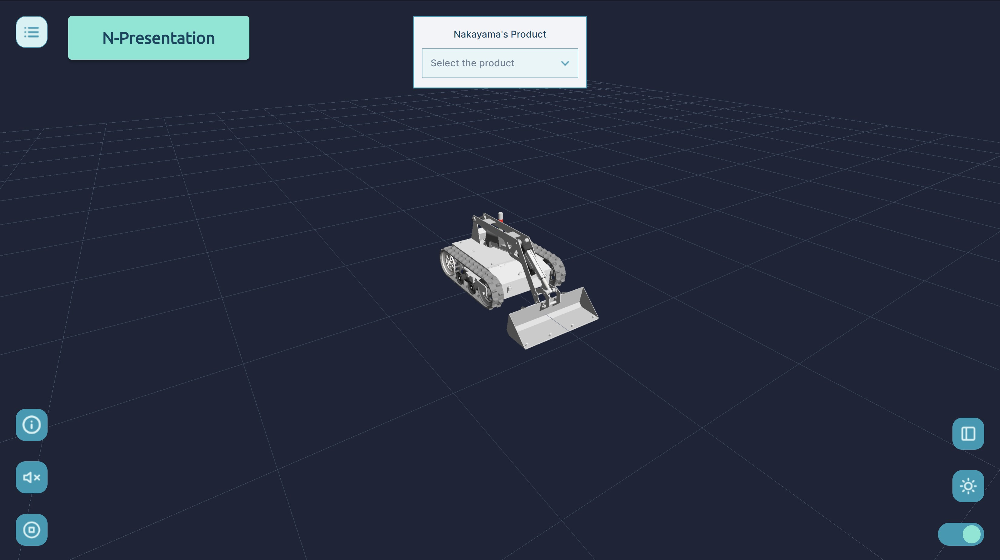
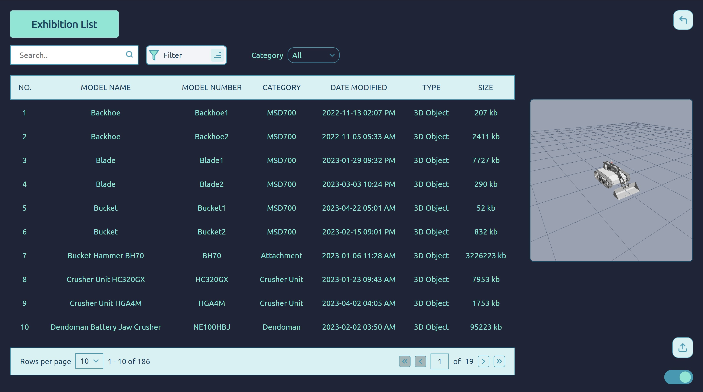

# Smart Presentation

Development of "Smart Presentation" Project by NIW & ITB De Labo

## Table of Contents

- [About The Project](#about-the-project)
- [Technologies Used](#technologies-used)
- [Prerequisites](#prerequisites)
- [Instalation](#instalation)
- [Project Status](#project-status)
- [Documentation](#Documentation)

## About The project

<!--  -->


Smart Presentation is a website that displays interactive 3D file of NIW products. User can zoom, change lightning, and rotate the 3D file displayed.

## Technologies Used

- 

- 

- 

- 

- 

## Prerequisites

- PHP v7.3++
- xampp

## Instalation

1. Clone the repo

```
https://github.com/itbdelaboprogramming/Smart_Presentation.git
```

2. Open website using XAMPP

## Project Status


## Documentation

- Home Page
  
- Database Page
  

Full documentation: https://docs.google.com/document/d/1TeYYyTkfv74lHPrsyegotYdW0ZNjrbEP7u-GcVrSQRU/edit#
